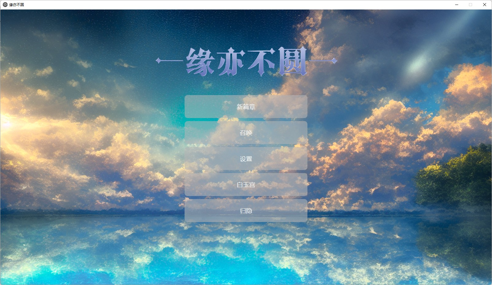
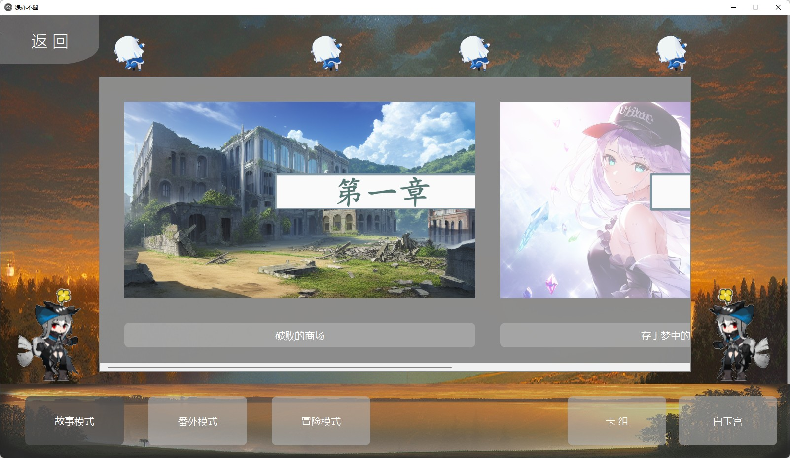
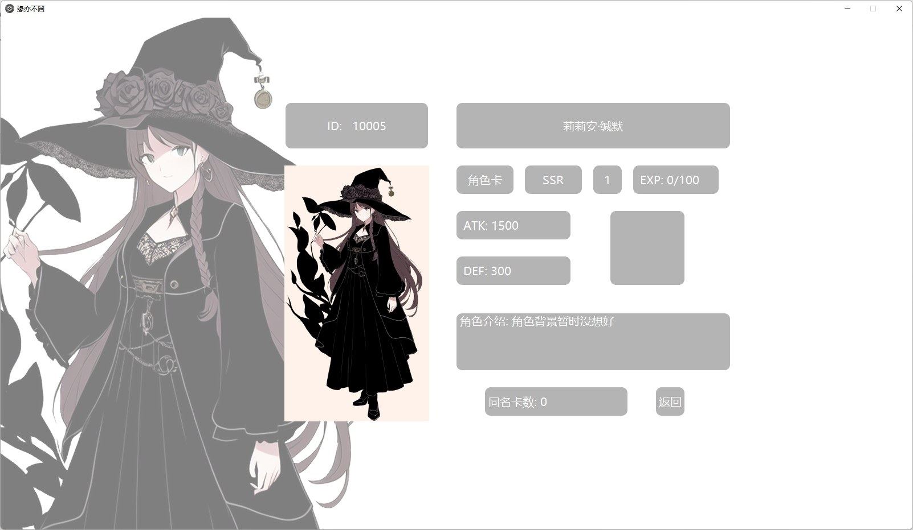
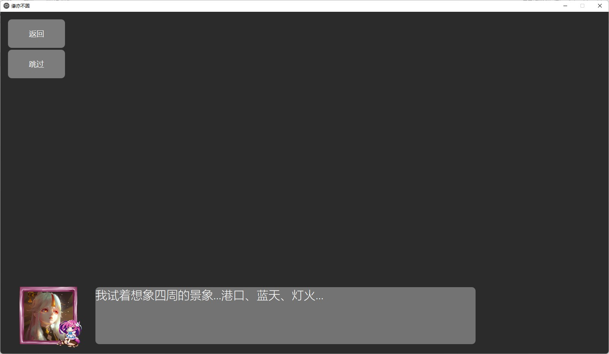
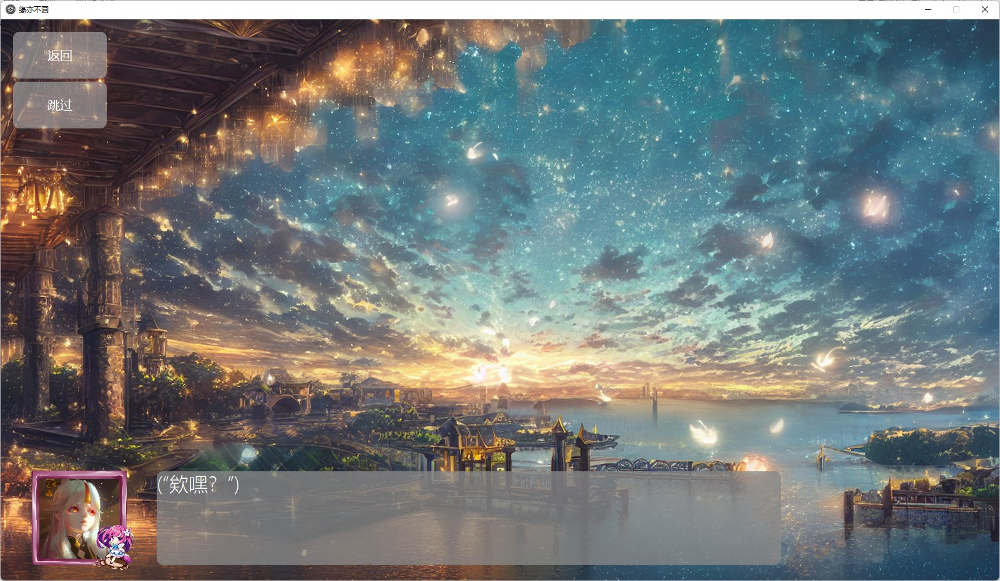
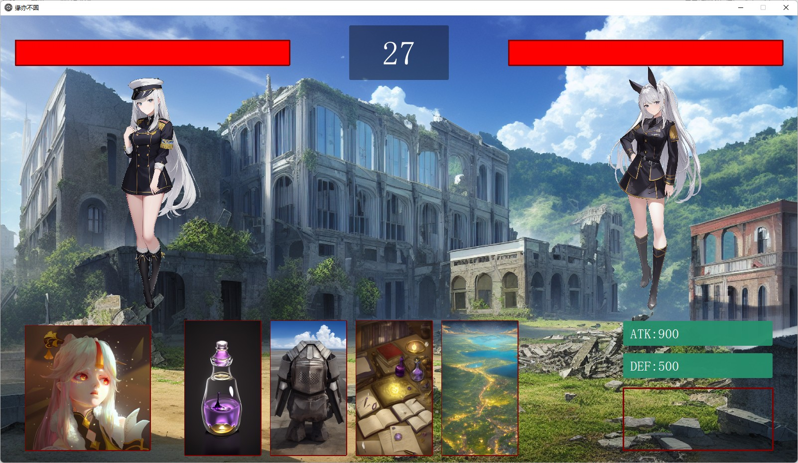
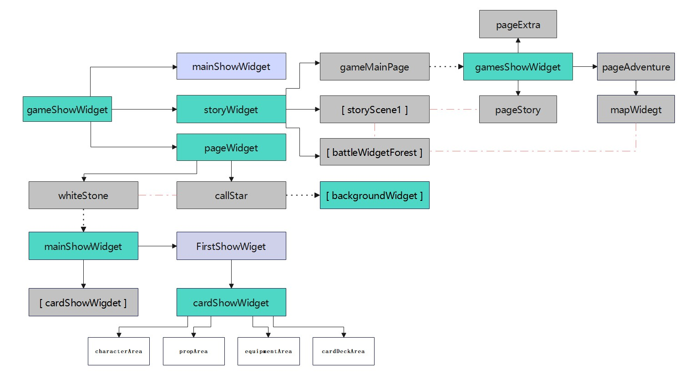
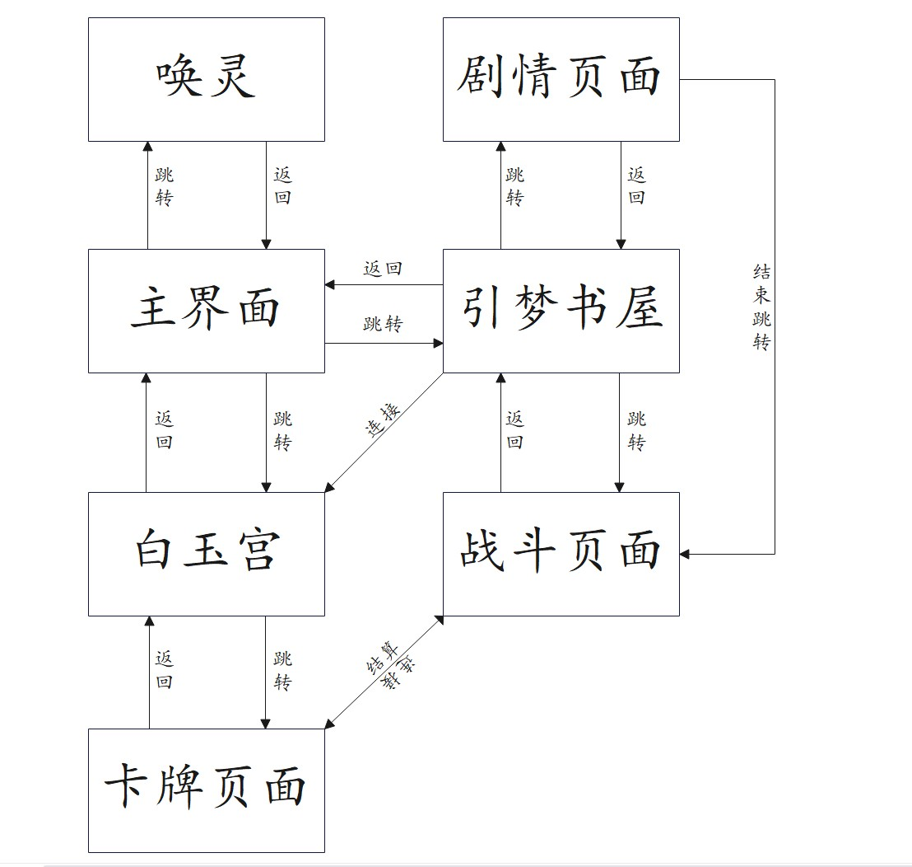
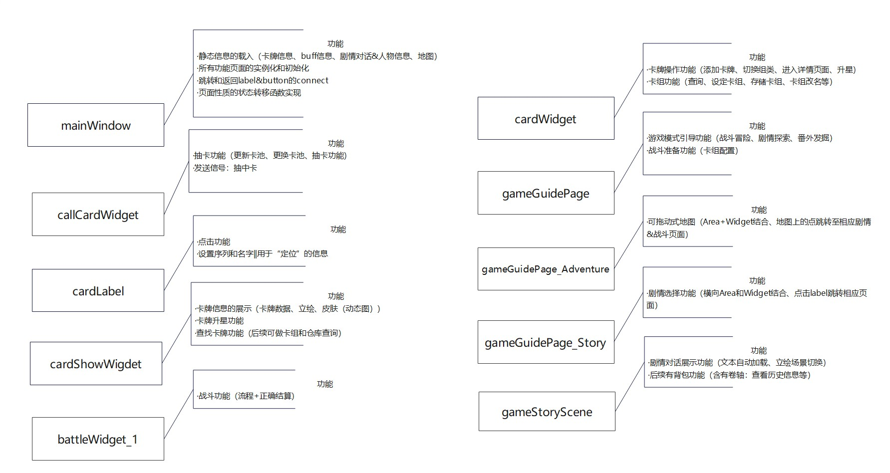

# MyGalgame
---
这是我一直想做的一个事情，写一个基于自己小说的galgame出来。对于此项目我会不断更新，同时也是作为编程学习的一个练习。
---
第一次使用GitHub的上传功能，代码传的有点乱。版本更新后会根据需要重新构建代码。
---
# 简单介绍一下该项目
> 
* 这个项目由c++Qt进行纯代码编写，资源文件夹内文件因为太多所以只好拆出来分开上传。
* 所有卡面立绘和场景图片均由AI生成并由我个人修正制作，gif类和头像是从网络上随机下载的图片.（顾及到版权原因，我会在之后通过ae重新制作gif小人和从AI生成的图中截取部分作为头像资源。）
* 本项目目前采取的是从excel中读取数据资料（剧情、资源位置、控制等）。目前我正在学习数据库相关课程，之后会一步步将数据转存至数据库中。
* 目前联网对战功能的学习已完成，之后会新开一个项目栏上传基于TCP/IP的一个石剪布联机对战小游戏。
---
# 项目预览图和相关结构图
>

---
>
 * 本项目的1.0版本在csdn上，不过那时候正处于萌新阶段所以这一次对代码进行了重开。（但是写完这个阶段后再回过头看依然觉得很乱，尤其是不久前学了一下设计模式www也许之后又会重开一个）

